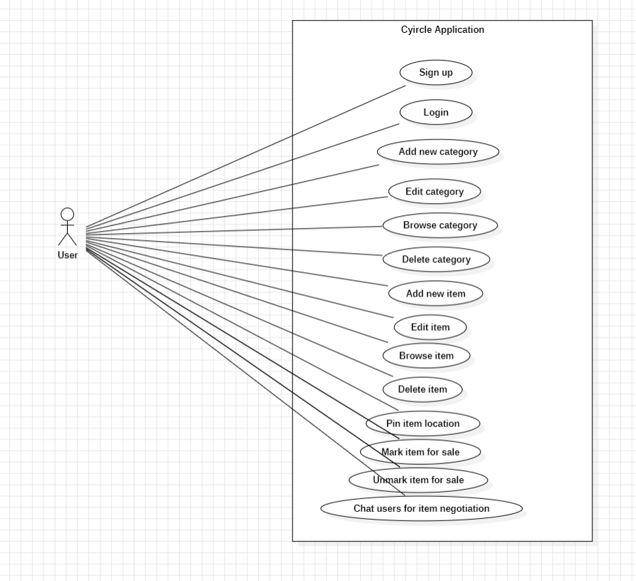
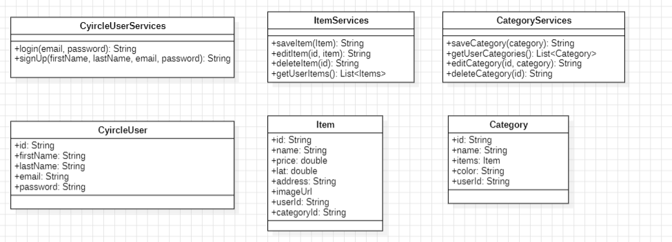

# Cyircle App Project

## Overview

Cyircle is a mobile application designed to help users manage their personal inventory. Users can keep track of their belongings, mark items for sale, and negotiate sales through a built-in chat feature. The app integrates location services to pin the item’s location on a map.

## Features

### Functional Requirements

- **User Authentication**:
  - Sign up to access the application.
  - Log in to access the application.
- **Category Management**:
  - Add categories of items.
  - Edit categories of items.
  - Browse categories of items.
  - Delete categories of items.
- **Inventory Management**:
  - Add items to the inventory.
  - Browse items in the inventory.
  - Edit items in the inventory.
  - Delete items from the inventory.
- **Location Tracking**:
  - Pin the current item location on the map.
- **Sales and Communication**:
  - Mark an item for sale.
  - Unmark an item for sale.
  - Chat with users to negotiate sales.

### Non-Functional Requirements

- The application is developed as a **mobile app**.
- **Frontend** technologies:
  - Flutter
  - Dart
- **Backend** services:
  - Firebase (Authentication, Firestore, Cloud Storage)

## Application Design

### Use Case Diagram



### Class Diagram



## Tech Stack

- **Frontend**: Flutter, Dart
- **Backend**: Firebase
  - Firebase Authentication
  - Firebase Firestore
  - Firebase Storage
  - Firebase Realtime Database (for chat)

## Setup Instructions

1. Clone the repository:
   ```bash
   git clone https://github.com/faruqonaayo/cyircle_app.git
   cd cyircle_app
   ```
